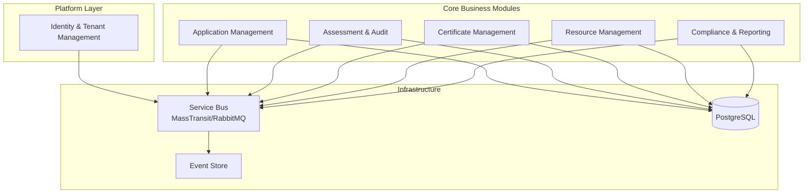
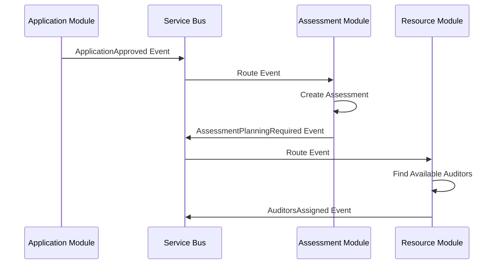
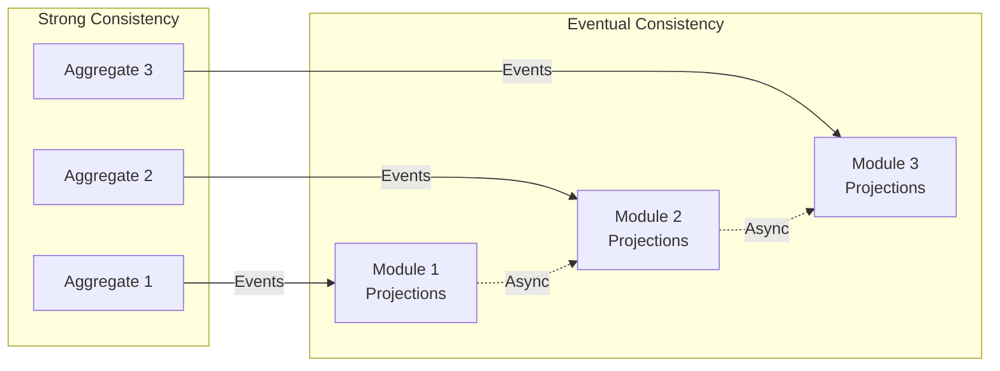
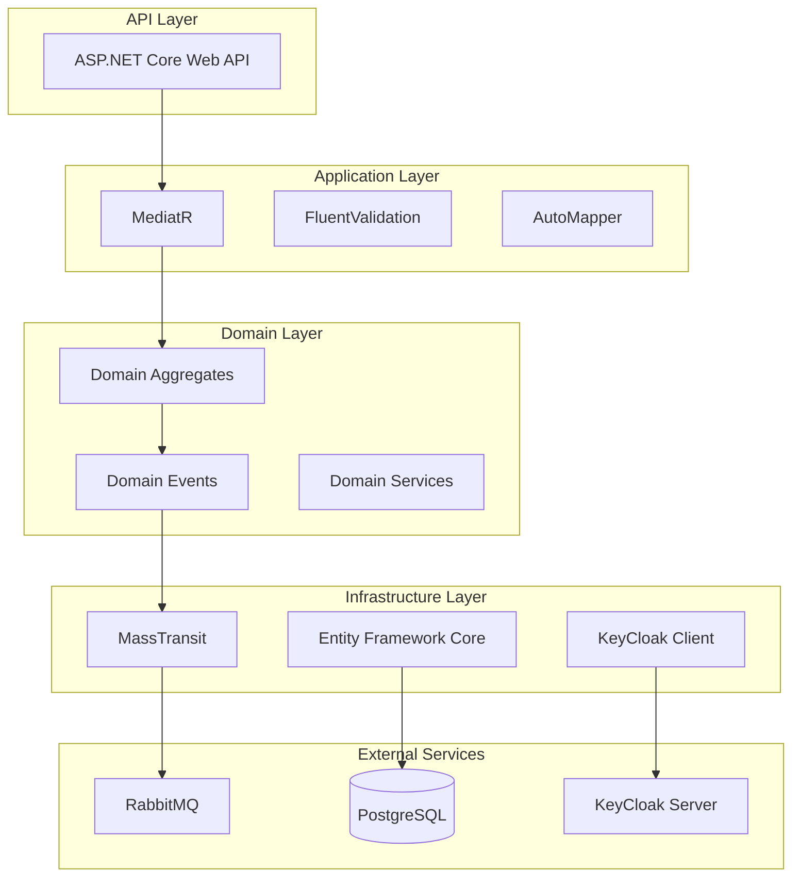
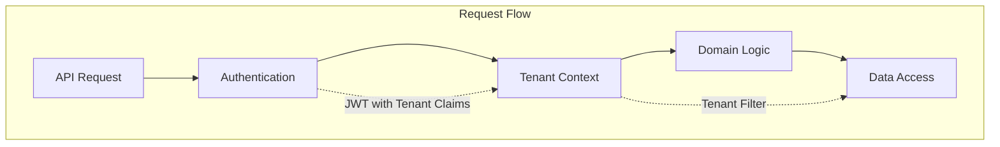
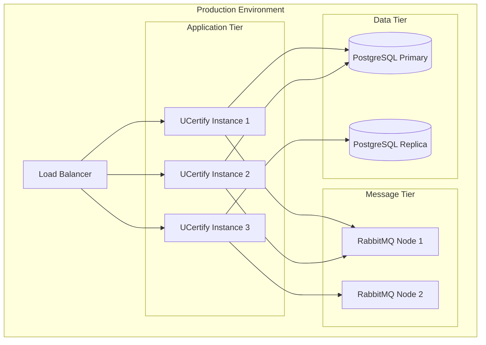

# UCertify Architecture Vision

## Executive Summary

UCertify is designed as a cloud-native, multi-tenant SaaS platform for Conformity Assessment Bodies (CABs). The architecture employs a **Modular Monolith** pattern that combines the development velocity of a monolithic architecture with the flexibility to evolve into microservices as scaling demands require. The system leverages Domain-Driven Design (DDD), Clean Architecture principles, and eventual consistency patterns to ensure scalability, maintainability, and tenant isolation.

## Architecture Overview

### Core Architectural Patterns

#### Modular Monolith
The platform is structured as a modular monolith where business capabilities are organized into well-defined modules with clear boundaries. All inter-module communication flows through a service bus abstraction (MassTransit with RabbitMQ), enabling seamless extraction of modules into microservices without code changes.

#### Multi-Tenant Architecture
Each Conformity Assessment Body (CAB) operates as an independent tenant with complete data isolation. The multi-tenancy design is domain-aware, meaning tenant boundaries are enforced at the domain model level rather than just infrastructure. For detailed tenant design, see [Multi-Tenancy Design](./domain-multi-tenancy.md).

#### Event-Driven Architecture
The system employs eventual consistency between modules through domain events. MediatR handles in-process domain events and command/query dispatching, while MassTransit manages inter-module communication and future microservice integration.

### Architectural Principles

1. **Domain-First Design**: Business logic encapsulated within domain aggregates following DDD principles
2. **Eventual Consistency**: Strong consistency within aggregate boundaries, eventual consistency across modules
3. **Tenant Isolation**: Complete data and process isolation between CABs enforced at domain level
4. **Event Sourcing Ready**: Architecture supports event sourcing for audit trails and compliance tracking
5. **API-First**: All functionality exposed through well-defined REST APIs

## Module Architecture

### Module Boundaries

### Module Descriptions

1. **Identity & Tenant Management Module**
   - Platform-level tenant lifecycle management
   - User authentication and authorization (KeyCloak integration)
   - Tenant onboarding and configuration
   - Cross-cutting tenant isolation enforcement

2. **Application Management Module**
   - Certification application intake and review
   - Client organization management
   - Document collection and validation
   - Application workflow orchestration

3. **Assessment & Audit Module**
   - Audit planning and scheduling
   - Finding management and classification
   - Corrective action tracking
   - Evidence collection and management

4. **Certificate Management Module**
   - Certificate issuance and lifecycle management
   - Surveillance scheduling and tracking
   - Certificate status management (active, suspended, withdrawn)
   - Public certificate registry

5. **Resource Management Module**
   - Auditor competence management
   - Resource scheduling and availability
   - Conflict of interest tracking
   - Professional development monitoring

6. **Compliance & Reporting Module**
   - ISO 17021 compliance tracking
   - Audit trail management
   - Analytics and dashboards
   - Accreditation body reporting

For detailed module design, see [Modular Architecture](./modular-architecture.md).

## Communication Patterns

### Intra-Module Communication
Within modules, components communicate through direct method calls and MediatR for command/query handling. This ensures high performance for cohesive business operations.

### Inter-Module Communication
All communication between modules flows through the service bus abstraction:

### Event Flow Patterns

1. **Command Events**: Directed operations requiring action from specific modules
2. **Integration Events**: Broadcast notifications of state changes
3. **Query Events**: Request-response patterns for cross-module data needs
4. **Saga Events**: Multi-step business process coordination

For messaging architecture details, see [Messaging Architecture](./messaging-architecture.md).

## Consistency Model

### Consistency Boundaries

### Consistency Levels

1. **Strong Consistency**: 
   - Within aggregate boundaries
   - Critical business operations (certification decisions, findings)
   - Financial transactions

2. **Eventual Consistency**:
   - Cross-module data synchronization
   - Read model projections
   - Analytics and reporting
   - Dashboard updates

3. **Session Consistency**:
   - User-specific views during active sessions
   - Workflow state management

## Technology Stack Integration

### Backend Architecture

### Key Technology Decisions

1. **MassTransit with RabbitMQ**: Enterprise-grade service bus for reliable messaging
2. **MediatR**: In-process messaging for CQRS and domain event handling
3. **Entity Framework Core**: ORM with multi-tenancy support
4. **KeyCloak**: Enterprise identity and access management
5. **.NET Aspire**: Cloud-native application orchestration

## Evolution Strategy

### Phase 1: Modular Monolith (Months 1-4)
- All modules deployed as single application
- In-memory service bus for inter-module communication
- Shared database with logical tenant separation
- Focus on core business functionality

### Phase 2: Service Bus Integration (Months 5-8)
- External RabbitMQ integration
- Message persistence and reliability
- Asynchronous processing capabilities
- Performance optimization

### Phase 3: Selective Extraction (Months 9+)
- Extract high-load modules as microservices
- Tenant-specific service instances for large CABs
- Independent scaling of critical components
- Zero-downtime migration strategy

## Security Architecture

### Tenant Isolation Enforcement

### Security Layers

1. **API Security**: OAuth 2.0 / OpenID Connect via KeyCloak
2. **Tenant Isolation**: Domain-enforced tenant boundaries
3. **Data Encryption**: Tenant-specific encryption keys
4. **Audit Trail**: Comprehensive event logging
5. **Compliance**: GDPR and SOC 2 compliance ready

## Operational Excellence

### Observability Strategy

1. **Distributed Tracing**: End-to-end request tracking across modules
2. **Metrics Collection**: Business and technical KPIs per tenant
3. **Centralized Logging**: Structured logs with tenant context
4. **Health Monitoring**: Module and dependency health checks

### Deployment Architecture

## Related Documentation

- [Domain Model](./domain-model.md) - Detailed domain design and aggregates
- [Multi-Tenancy Design](./domain-multi-tenancy.md) - Tenant isolation patterns
- [Modular Architecture](./modular-architecture.md) - Module boundaries and contracts
- [Messaging Architecture](./messaging-architecture.md) - Service bus and event patterns
- [API Design Guidelines](./api-design-guidelines.md) - REST API standards
- [Deployment Guide](./deployment-guide.md) - Production deployment strategies

---

*Document Version: 1.0*  
*Last Updated: 2025-01-06*  
*Architecture Review Cycle: Quarterly*

**Note**: This architecture vision represents the target state for the UCertify platform. Implementation will follow an iterative approach, with continuous refinement based on operational insights and business requirements.