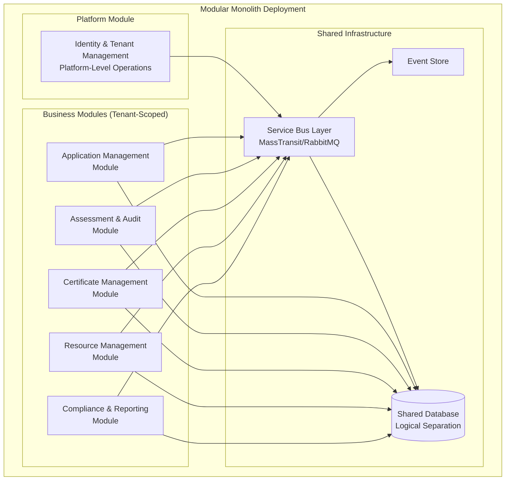
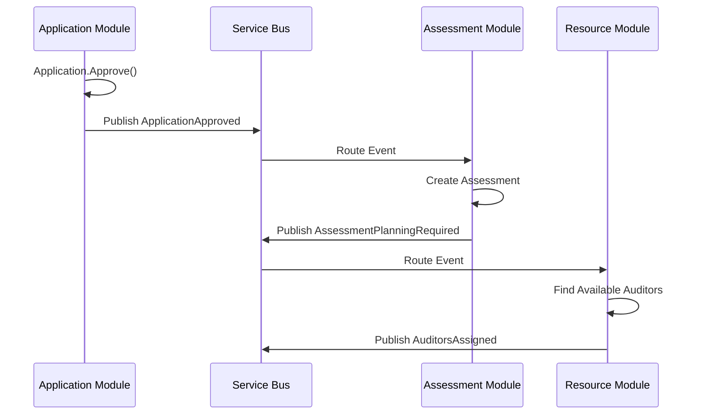

# U-Certify Domain Model Analysis

## Overview

This document analyzes the business requirements from the U-Certify platform and defines the domain model including entities, value objects, aggregates, and the recommended project structure for the `UCertify.Domain` project.

**Domain**: Conformity Assessment Body (CAB) Management System  
**Standards Focus**: ISO/IEC 17021-1:2015 - Management System Certification Bodies  
**Business Context**: Certification lifecycle management from application to certificate maintenance  
**Architecture**: **Multi-Tenant SaaS Platform** - Each CAB operates as an independent tenant
**Communication**: **Service Bus-Enabled Modular Monolith** - Inter-module communication via MassTransit/RabbitMQ
**Consistency Model**: **Eventual Consistency** - Strong consistency within aggregates, eventual consistency across modules

---

## Multi-Tenancy Design Approach

### Tenant Model

In UCertify, each **Conformity Assessment Body (CAB)** represents a separate tenant with complete data isolation:

- **Tenant**: CAB organization (e.g., "ABC Certification Ltd")
- **Tenant Isolation**: All aggregates are scoped to a specific CAB
- **Data Separation**: Logical separation with CAB-scoped data access
- **Business Rules**: Some rules are tenant-specific (CAB accreditation scope, policies)

### Tenant-Aware Domain Design

**Approach**: **Domain-Aware Multi-Tenancy**

- Tenant context is part of the domain model (not just infrastructure)
- All aggregate roots include tenant identification
- Business rules can be tenant-specific
- Domain services are tenant-scoped

---

## Modular Monolith Architecture

The UCertify platform implements a **Service Bus-Enabled Modular Monolith** architecture where each module represents a distinct bounded context with well-defined responsibilities. Modules communicate exclusively through a service bus abstraction (MassTransit with RabbitMQ), enabling seamless evolution to microservices without code changes.

### Module Architecture Overview



### Modular Monolith Principles

1. **Module Isolation**: Each module has its own domain model, business logic, and data access
2. **Service Bus Communication**: All inter-module communication flows through the service bus
3. **Shared Infrastructure**: Common infrastructure components (database, messaging) are shared
4. **Independent Deployment Ready**: Modules can be extracted as microservices without code changes
5. **Tenant Isolation**: Business modules are tenant-scoped; platform module manages tenants

### Bounded Context Definitions

1. **Identity & Tenant Management Bounded Context**
   - **Purpose**: Platform-level tenant lifecycle and user authentication
   - **Scope**: Cross-tenant platform operations
   - **Key Concepts**: CAB, User, Role, Tenant Configuration
   - **Communication**: Publishes tenant lifecycle events, handles platform commands

2. **Application Management Bounded Context**
   - **Purpose**: Certification application intake and client organization management
   - **Scope**: Single CAB operations
   - **Key Concepts**: Application, Client, ApplicationReview, Document
   - **Communication**: Publishes application lifecycle events

3. **Assessment & Audit Bounded Context**
   - **Purpose**: Complete audit lifecycle from planning to recommendation
   - **Scope**: Single CAB operations
   - **Key Concepts**: Assessment, AuditPlan, Finding, CorrectiveAction, AuditTeam
   - **Communication**: Subscribes to application events, publishes assessment events

4. **Certificate Management Bounded Context**
   - **Purpose**: Certificate issuance, lifecycle, and surveillance management
   - **Scope**: Single CAB operations
   - **Key Concepts**: Certificate, CertificateScope, SurveillanceSchedule
   - **Communication**: Subscribes to assessment events, publishes certificate events

5. **Resource Management Bounded Context**
   - **Purpose**: Auditor competence, availability, and assignment management
   - **Scope**: Single CAB operations
   - **Key Concepts**: Auditor, Competence, Assignment, ConflictOfInterest
   - **Communication**: Responds to assignment requests, publishes resource events

6. **Compliance & Reporting Bounded Context**
   - **Purpose**: Cross-module compliance tracking and analytics
   - **Scope**: Single CAB operations with cross-module projections
   - **Key Concepts**: ComplianceRequirement, AuditTrail, PerformanceMetric
   - **Communication**: Subscribes to all business events, publishes compliance alerts

### Module Communication Principles

- **No Direct Dependencies**: Modules communicate exclusively through service bus messages
- **Async by Default**: All inter-module communication is asynchronous via integration events
- **Contract-First**: Message contracts define module interfaces
- **Tenant Isolation**: All messages include tenant context for proper routing
- **Eventual Consistency**: Modules maintain their own projections of required external data

For detailed module design and interfaces, see [Modular Architecture](./modular-architecture.md).

---

## Module Domain Models

Each bounded context (module) contains its own domain model with aggregates, entities, value objects, and domain services. This section details the domain model for each module, emphasizing the tenant-scoped nature of business modules.

---

### 1. Identity & Tenant Management Module

**Bounded Context**: Platform-level tenant and user management  
**Tenant Scope**: Platform-wide (manages tenants themselves)

#### CAB Configuration Aggregate

**Aggregate Root**: `ConformityAssessmentBody`  
**Purpose**: Represents the tenant itself and manages organizational setup, accreditation, and compliance policies.

**Entities:**

- `ConformityAssessmentBody` *(Aggregate Root)* - **The tenant/CAB organization**
- `AccreditationScope` - Standards and sectors accredited for
- `ComplianceRequirement` - ISO 17021 clause tracking
- `InternalAudit` - Internal quality audits
- `ManagementReview` - Management system reviews
- `TenantConfiguration` - Tenant-specific settings and policies

**Value Objects:**

- `CABId` - **Primary tenant identifier** - globally unique
- `AccreditationBody` - ANAB, UKAS, etc.
- `AccreditationNumber` - Official accreditation reference
- `ComplianceStatus` - Requirements compliance tracking
- `ScopeOfAccreditation` - Authorized certification activities
- `TenantSettings` - CAB-specific business rules and configurations

**Domain Services:**

- `TenantProvisioningService` - New CAB setup and onboarding
- `AccreditationComplianceService` - ISO 17021 compliance tracking
- `TenantConfigurationService` - Tenant-specific rule management

**Integration Events Published:**

- `CABRegistered` - New tenant created
- `CABConfigurationUpdated` - Tenant settings changed
- `CABSuspended` - Tenant access restricted
- `AccreditationUpdated` - Accreditation scope changed

#### User Management Aggregate

**Aggregate Root**: `User`  
**Purpose**: Platform user management with tenant association

**Entities:**

- `User` *(Aggregate Root)* - Platform user account
- `UserRole` - Tenant-specific role assignments
- `UserSession` - Authentication session tracking

**Value Objects:**

- `UserId` - Global user identifier
- `TenantMembership` - User-CAB associations
- `RolePermissions` - Tenant-scoped permissions
- `AuthenticationCredentials` - Authentication details

**Integration Events Published:**

- `UserCreated` - New user account
- `UserRoleChanged` - Role assignments updated
- `UserDeactivated` - User access removed

---

### 2. Application Management Module

**Bounded Context**: Certification application lifecycle  
**Tenant Scope**: CAB-specific

#### Application Aggregate

**Aggregate Root**: `Application`  
**Purpose**: Manages certification request lifecycle from submission to approval/rejection

**Entities:**

- `Application` *(Aggregate Root)* - Primary certification request
- `ApplicationReview` - Review process and decisions
- `ApplicationDocument` - Supporting documentation

**Value Objects:**

- `ApplicationId` - Unique identifier (APP-YYYY-NNNNN format) - **tenant-scoped uniqueness**
- `ApplicationStatus` - Workflow state (Received, Under Review, Approved, etc.)
- `CertificationScope` - Description of activities to be certified
- `ContactInformation` - Client contact details
- `ApplicationSubmissionDetails` - Channel, timestamp, source
- `TenantId` - CAB identifier for tenant isolation

**Domain Services:**

- `ApplicationValidationService` - Business rule validation
- `DocumentVerificationService` - Document completeness checking
- `ApplicationWorkflowService` - Status transition management

**Integration Events Published:**

- `ApplicationReceived` - New application submitted
- `ApplicationApproved` - Application approved for assessment
- `ApplicationRejected` - Application rejected with reasons
- `ClientRegistered` - New client organization created

**Integration Events Subscribed:**

- `CABConfigurationUpdated` - Update application policies

#### Client Aggregate

**Aggregate Root**: `Client`  
**Purpose**: Client organization and site management

**Entities:**

- `Client` *(Aggregate Root)* - Client organization
- `Site` - Physical locations within certification scope
- `CertificationHistory` - Previous and current certifications

**Value Objects:**

- `ClientId` - Unique client identifier - **tenant-scoped**
- `LegalEntityName` - Official organization name
- `Address` - Physical address details
- `EmployeeCount` - FTE count for audit duration calculation
- `MultiSiteConfiguration` - Central office designation and site relationships
- `PreviousCertificationDetails` - Transfer information from other CABs

**Domain Services:**

- `ClientUniquenessService` - Ensure unique client names within tenant
- `MultiSiteManagementService` - Site relationship management
- `ClientDataSynchronizationService` - Cross-module data consistency

**Integration Events Published:**

- `ClientRegistered` - New client organization created
- `ClientUpdated` - Client information changed
- `SiteAdded` - New client site registered

---

### 3. Assessment & Audit Module

**Bounded Context**: Audit execution and findings management  
**Tenant Scope**: CAB-specific

#### Assessment Aggregate

**Aggregate Root**: `Assessment`  
**Purpose**: Complete audit process including planning, execution, and findings

**Entities:**

- `Assessment` *(Aggregate Root)* - Main audit/assessment process
- `AuditPlan` - Detailed audit planning and schedule
- `AuditTeam` - Team composition and roles
- `Finding` - Individual audit findings and nonconformities
- `CorrectiveAction` - Client responses to findings
- `AuditSession` - Daily audit activities and evidence collection

**Value Objects:**

- `AssessmentId` - Unique assessment identifier - **tenant-scoped**
- `AssessmentType` - Stage 1, Stage 2, Surveillance, Recertification
- `AssessmentStatus` - Planned, In Progress, Completed, Report Issued
- `AuditDuration` - Time allocation based on organization size
- `FindingClassification` - Major NC, Minor NC, Observation, OFI
- `AuditEvidence` - Objective evidence supporting findings
- `AssessmentRecommendation` - Recommend/Conditional/Do Not Recommend

**Domain Services:**

- `AuditPlanningService` - Duration calculation and team assignment
- `FindingClassificationService` - Finding severity determination
- `AssessmentRecommendationService` - Certification recommendation logic
- `EvidenceValidationService` - Audit evidence verification

**Integration Events Published:**

- `AssessmentPlanned` - Assessment scheduled with team
- `FindingRecorded` - New nonconformity or observation
- `AssessmentCompleted` - Audit finished with recommendation
- `CorrectiveActionRequired` - Client action needed

**Integration Events Subscribed:**

- `ApplicationApproved` - Trigger assessment planning
- `AuditorAssigned` - Update assessment team
- `ClientUpdated` - Update assessment client data

---

### 4. Certificate Management Module

**Bounded Context**: Certificate lifecycle and surveillance  
**Tenant Scope**: CAB-specific

#### Certificate Aggregate

**Aggregate Root**: `Certificate`  
**Purpose**: Certificate issuance and lifecycle management

**Entities:**

- `Certificate` *(Aggregate Root)* - Issued certification document
- `CertificateScope` - Detailed scope of certification
- `SurveillanceSchedule` - Ongoing surveillance audit planning

**Value Objects:**

- `CertificateId` - Unique certificate identifier - **tenant-scoped**
- `CertificateNumber` - Public certificate reference - **globally unique with CAB prefix**
- `CertificationStandard` - ISO 9001, 14001, 45001, etc.
- `CertificateStatus` - Active, Suspended, Withdrawn, Expired
- `ValidityPeriod` - Issue date, expiry date, 3-year cycle
- `CertificationDecision` - Grant, Refuse, Conditional grant

**Domain Services:**

- `CertificateIssuanceService` - Certificate creation and numbering
- `SurveillanceSchedulingService` - Ongoing audit planning
- `CertificateValidationService` - Status transition validation
- `PublicRegistryService` - Public certificate verification

**Integration Events Published:**

- `CertificateIssued` - New certificate created
- `CertificateSuspended` - Certificate suspended
- `CertificateWithdrawn` - Certificate withdrawn
- `SurveillanceScheduled` - Surveillance audit planned

**Integration Events Subscribed:**

- `AssessmentCompleted` - Process certification decision
- `FindingRecorded` - Evaluate certificate impact

---

### 5. Resource Management Module

**Bounded Context**: Auditor competence and resource management  
**Tenant Scope**: CAB-specific

#### Auditor Aggregate

**Aggregate Root**: `Auditor`  
**Purpose**: Auditor profile, competence, and availability management

**Entities:**

- `Auditor` *(Aggregate Root)* - Individual auditor
- `Competence` - Standard-specific qualifications
- `Assignment` - Audit assignments and roles
- `ProfessionalDevelopment` - CPD tracking

**Value Objects:**

- `AuditorId` - Unique auditor identifier - **tenant-scoped**
- `AuditorRole` - Lead Auditor, Auditor, Technical Expert
- `CompetenceMatrix` - Standards and sectors qualified for
- `Availability` - Schedule and capacity
- `ConflictOfInterest` - Client relationship restrictions

**Domain Services:**

- `AuditorAssignmentService` - Competence matching and assignment
- `ConflictOfInterestService` - Conflict checking and management
- `CompetenceManagementService` - Qualification tracking
- `AvailabilityManagementService` - Resource scheduling

**Integration Events Published:**

- `AuditorRegistered` - New auditor added
- `AuditorAssigned` - Auditor assigned to assessment
- `ConflictIdentified` - Conflict of interest found
- `CompetenceUpdated` - Auditor qualifications changed

**Integration Events Subscribed:**

- `AssessmentPlanningRequired` - Find available auditors
- `AssessmentCompleted` - Update auditor experience

---

### 6. Compliance & Reporting Module

**Bounded Context**: Cross-module compliance and analytics  
**Tenant Scope**: CAB-specific with cross-module projections

#### Compliance Aggregate

**Aggregate Root**: `ComplianceTracking`  
**Purpose**: ISO 17021 compliance monitoring and evidence collection

**Entities:**

- `ComplianceTracking` *(Aggregate Root)* - Overall compliance status
- `ComplianceRequirement` - Specific ISO 17021 clauses
- `ComplianceEvidence` - Supporting documentation
- `ComplianceAudit` - Internal compliance audits

**Value Objects:**

- `ComplianceId` - Unique compliance tracking identifier
- `RequirementStatus` - Compliant, Non-Compliant, Pending
- `EvidenceType` - Document, Record, Observation
- `ComplianceScore` - Quantitative compliance assessment

**Domain Services:**

- `ComplianceMonitoringService` - Real-time compliance tracking
- `AuditTrailService` - Event aggregation and analysis
- `ReportingService` - Analytics and dashboard generation
- `PerformanceMetricsService` - KPI calculation and trending

**Integration Events Published:**

- `ComplianceViolationDetected` - Non-compliance identified
- `ReportGenerated` - Compliance report created
- `MetricThresholdExceeded` - Performance alert triggered

**Integration Events Subscribed:**

- *All business events from other modules* - For audit trail and analytics

---

## Module Communication Patterns

### Intra-Module Communication

Within each module, components communicate through:

- **Direct Method Calls**: Between entities within the same aggregate
- **MediatR Commands/Queries**: Between application services and domain
- **Domain Events**: Published by aggregates, handled within the same module
- **Domain Services**: Coordinate complex business logic within module boundaries

### Inter-Module Communication

Modules communicate exclusively through the service bus:

- **Integration Events**: Asynchronous event publication via MassTransit
- **Message Contracts**: Versioned event schemas shared between modules
- **Tenant Context**: All messages include tenant ID for proper routing
- **No Direct Dependencies**: Modules cannot directly reference each other



### Event Types

1. **Domain Events** (MediatR - Intra-Module)
   - Published within aggregate boundaries
   - Synchronous handling within module
   - Examples: `ApplicationStatusChanged`, `FindingClassified`

2. **Integration Events** (MassTransit - Inter-Module)
   - Published across module boundaries
   - Asynchronous handling with eventual consistency
   - Examples: `ApplicationApproved`, `AssessmentCompleted`

---

## Consistency and Transaction Boundaries

### Strong Consistency (Within Modules)

- **Aggregate Boundaries**: All changes within an aggregate are atomic
- **Database Transactions**: Module operations complete within single transaction
- **Business Invariants**: Enforced immediately within module boundaries
- **ACID Properties**: Full ACID guarantees for intra-module operations

### Eventual Consistency (Across Modules)

- **Integration Events**: State synchronization via asynchronous events
- **Projection Updates**: Read models updated through event streams
- **Compensating Actions**: Saga patterns for long-running processes
- **Retry Mechanisms**: Automatic retry for failed event processing

### Saga Orchestration

Complex business processes that span modules use the Saga pattern:

- **Certification Process Saga**: Orchestrates application → assessment → certificate
- **Assessment Execution Saga**: Coordinates planning → execution → reporting
- **Corrective Action Saga**: Manages finding → response → verification
---

## Modular Monolith Project Structure

The domain project structure reflects the modular architecture with clear module boundaries:

```
UCertify.Domain/
├── Common/
│   ├── Base/
│   │   ├── Entity.cs
│   │   ├── AggregateRoot.cs
│   │   ├── ValueObject.cs
│   │   ├── DomainEvent.cs
│   │   └── IntegrationEvent.cs
│   ├── MultiTenancy/
│   │   ├── ITenantAware.cs
│   │   ├── TenantId.cs
│   │   ├── ITenantContext.cs
│   │   └── TenantScopedId.cs
│   ├── ValueObjects/
│   │   ├── EmailAddress.cs
│   │   ├── PhoneNumber.cs
│   │   ├── Address.cs
│   │   ├── DateRange.cs
│   │   └── Money.cs
│   ├── Enums/
│   │   ├── AuditStage.cs
│   │   ├── Standard.cs
│   │   └── Priority.cs
│   └── Exceptions/
│       ├── DomainException.cs
│       ├── BusinessRuleViolationException.cs
│       └── TenantIsolationViolationException.cs
│
├── Modules/
│   ├── IdentityTenantManagement/
│   │   ├── Aggregates/
│   │   │   ├── CABConfiguration/
│   │   │   │   ├── ConformityAssessmentBody.cs
│   │   │   │   ├── AccreditationScope.cs
│   │   │   │   ├── TenantConfiguration.cs
│   │   │   │   └── ValueObjects/
│   │   │   │       ├── CABId.cs
│   │   │   │       ├── AccreditationNumber.cs
│   │   │   │       └── TenantSettings.cs
│   │   │   └── UserManagement/
│   │   │       ├── User.cs
│   │   │       ├── UserRole.cs
│   │   │       └── ValueObjects/
│   │   │           ├── UserId.cs
│   │   │           └── TenantMembership.cs
│   │   ├── DomainServices/
│   │   │   ├── TenantProvisioningService.cs
│   │   │   └── AccreditationComplianceService.cs
│   │   ├── Events/
│   │   │   ├── Domain/
│   │   │   │   ├── CABCreated.cs
│   │   │   │   └── UserAssignedToTenant.cs
│   │   │   └── Integration/
│   │   │       ├── CABRegistered.cs
│   │   │       ├── CABSuspended.cs
│   │   │       └── UserCreated.cs
│   │   └── Specifications/
│   │       ├── TenantIsolationCompliance.cs
│   │       └── AccreditationValidation.cs
│   │
│   ├── ApplicationManagement/
│   │   ├── Aggregates/
│   │   │   ├── Application/
│   │   │   │   ├── Application.cs
│   │   │   │   ├── ApplicationReview.cs
│   │   │   │   ├── ApplicationDocument.cs
│   │   │   │   └── ValueObjects/
│   │   │   │       ├── ApplicationId.cs
│   │   │   │       ├── ApplicationStatus.cs
│   │   │   │       ├── CertificationScope.cs
│   │   │   │       └── ContactInformation.cs
│   │   │   └── Client/
│   │   │       ├── Client.cs
│   │   │       ├── Site.cs
│   │   │       ├── CertificationHistory.cs
│   │   │       └── ValueObjects/
│   │   │           ├── ClientId.cs
│   │   │           ├── LegalEntityName.cs
│   │   │           ├── EmployeeCount.cs
│   │   │           └── MultiSiteConfiguration.cs
│   │   ├── DomainServices/
│   │   │   ├── ApplicationValidationService.cs
│   │   │   ├── DocumentVerificationService.cs
│   │   │   └── ClientUniquenessService.cs
│   │   ├── Events/
│   │   │   ├── Domain/
│   │   │   │   ├── ApplicationStatusChanged.cs
│   │   │   │   └── ClientInformationUpdated.cs
│   │   │   └── Integration/
│   │   │       ├── ApplicationReceived.cs
│   │   │       ├── ApplicationApproved.cs
│   │   │       ├── ApplicationRejected.cs
│   │   │       └── ClientRegistered.cs
│   │   └── Specifications/
│   │       ├── ApplicationCompleteness.cs
│   │       ├── DuplicateApplicationCheck.cs
│   │       └── ClientUniqueness.cs
│   │
│   ├── AssessmentAudit/
│   │   ├── Aggregates/
│   │   │   └── Assessment/
│   │   │       ├── Assessment.cs
│   │   │       ├── AuditPlan.cs
│   │   │       ├── AuditTeam.cs
│   │   │       ├── Finding.cs
│   │   │       ├── CorrectiveAction.cs
│   │   │       ├── AuditSession.cs
│   │   │       └── ValueObjects/
│   │   │           ├── AssessmentId.cs
│   │   │           ├── AssessmentType.cs
│   │   │           ├── AssessmentStatus.cs
│   │   │           ├── AuditDuration.cs
│   │   │           ├── FindingClassification.cs
│   │   │           ├── AuditEvidence.cs
│   │   │           └── AssessmentRecommendation.cs
│   │   ├── DomainServices/
│   │   │   ├── AuditPlanningService.cs
│   │   │   ├── FindingClassificationService.cs
│   │   │   ├── AssessmentRecommendationService.cs
│   │   │   └── EvidenceValidationService.cs
│   │   ├── Events/
│   │   │   ├── Domain/
│   │   │   │   ├── FindingClassified.cs
│   │   │   │   └── EvidenceCollected.cs
│   │   │   └── Integration/
│   │   │       ├── AssessmentPlanned.cs
│   │   │       ├── FindingRecorded.cs
│   │   │       ├── AssessmentCompleted.cs
│   │   │       └── CorrectiveActionRequired.cs
│   │   └── Specifications/
│   │       ├── Stage2Prerequisites.cs
│   │       ├── AuditDurationCompliance.cs
│   │       └── FindingClassificationRules.cs
│   │
│   ├── CertificateManagement/
│   │   ├── Aggregates/
│   │   │   └── Certificate/
│   │   │       ├── Certificate.cs
│   │   │       ├── CertificateScope.cs
│   │   │       ├── SurveillanceSchedule.cs
│   │   │       └── ValueObjects/
│   │   │           ├── CertificateId.cs
│   │   │           ├── CertificateNumber.cs
│   │   │           ├── CertificationStandard.cs
│   │   │           ├── CertificateStatus.cs
│   │   │           ├── ValidityPeriod.cs
│   │   │           └── CertificationDecision.cs
│   │   ├── DomainServices/
│   │   │   ├── CertificateIssuanceService.cs
│   │   │   ├── SurveillanceSchedulingService.cs
│   │   │   ├── CertificateValidationService.cs
│   │   │   └── PublicRegistryService.cs
│   │   ├── Events/
│   │   │   ├── Domain/
│   │   │   │   ├── CertificateStatusChanged.cs
│   │   │   │   └── SurveillancePlanned.cs
│   │   │   └── Integration/
│   │   │       ├── CertificateIssued.cs
│   │   │       ├── CertificateSuspended.cs
│   │   │       ├── CertificateWithdrawn.cs
│   │   │       └── SurveillanceScheduled.cs
│   │   └── Specifications/
│   │       ├── CertificateValidityRules.cs
│   │       └── SurveillanceRequirements.cs
│   │
│   ├── ResourceManagement/
│   │   ├── Aggregates/
│   │   │   └── Auditor/
│   │   │       ├── Auditor.cs
│   │   │       ├── Competence.cs
│   │   │       ├── Assignment.cs
│   │   │       ├── ProfessionalDevelopment.cs
│   │   │       └── ValueObjects/
│   │   │           ├── AuditorId.cs
│   │   │           ├── AuditorRole.cs
│   │   │           ├── CompetenceMatrix.cs
│   │   │           ├── Availability.cs
│   │   │           └── ConflictOfInterest.cs
│   │   ├── DomainServices/
│   │   │   ├── AuditorAssignmentService.cs
│   │   │   ├── ConflictOfInterestService.cs
│   │   │   ├── CompetenceManagementService.cs
│   │   │   └── AvailabilityManagementService.cs
│   │   ├── Events/
│   │   │   ├── Domain/
│   │   │   │   ├── CompetenceValidated.cs
│   │   │   │   └── AvailabilityUpdated.cs
│   │   │   └── Integration/
│   │   │       ├── AuditorRegistered.cs
│   │   │       ├── AuditorAssigned.cs
│   │   │       ├── ConflictIdentified.cs
│   │   │       └── CompetenceUpdated.cs
│   │   └── Specifications/
│   │       ├── AuditorQualifications.cs
│   │       ├── ConflictOfInterestRules.cs
│   │       └── CompetenceRequirements.cs
│   │
│   └── ComplianceReporting/
│       ├── Aggregates/
│       │   └── ComplianceTracking/
│       │       ├── ComplianceTracking.cs
│       │       ├── ComplianceRequirement.cs
│       │       ├── ComplianceEvidence.cs
│       │       ├── ComplianceAudit.cs
│       │       └── ValueObjects/
│       │           ├── ComplianceId.cs
│       │           ├── RequirementStatus.cs
│       │           ├── EvidenceType.cs
│       │           └── ComplianceScore.cs
│       ├── DomainServices/
│       │   ├── ComplianceMonitoringService.cs
│       │   ├── AuditTrailService.cs
│       │   ├── ReportingService.cs
│       │   └── PerformanceMetricsService.cs
│       ├── Events/
│       │   ├── Domain/
│       │   │   ├── ComplianceEvaluated.cs
│       │   │   └── MetricCalculated.cs
│       │   └── Integration/
│       │       ├── ComplianceViolationDetected.cs
│       │       ├── ReportGenerated.cs
│       │       └── MetricThresholdExceeded.cs
│       └── Specifications/
│           ├── ISO17021Requirements.cs
│           └── ComplianceThresholds.cs
│
├── Contracts/
│   ├── Commands/
│   │   ├── ApplicationManagement/
│   │   │   ├── SubmitApplicationCommand.cs
│   │   │   └── ApproveApplicationCommand.cs
│   │   ├── AssessmentAudit/
│   │   │   ├── PlanAssessmentCommand.cs
│   │   │   └── RecordFindingCommand.cs
│   │   └── (other modules...)
│   ├── Queries/
│   │   ├── ApplicationManagement/
│   │   │   ├── GetApplicationDetailsQuery.cs
│   │   │   └── GetClientApplicationsQuery.cs
│   │   └── (other modules...)
│   └── Events/
│       ├── ApplicationManagement/
│       │   ├── ApplicationApproved.cs
│       │   └── ApplicationRejected.cs
│       ├── AssessmentAudit/
│       │   ├── AssessmentCompleted.cs
│       │   └── FindingRecorded.cs
│       └── (other modules...)
│
└── Repositories/
    ├── IApplicationRepository.cs
    ├── IAssessmentRepository.cs
    ├── ICertificateRepository.cs
    ├── IAuditorRepository.cs
    ├── IComplianceRepository.cs
    └── ITenantRepository.cs
```
- Tenant-specific configuration management

---

## Multi-Tenant Implementation Within Modules

The multi-tenant capabilities of UCertify are implemented within the modular monolith architecture described in the **"Modular Monolith Project Structure"** section above. Each module maintains tenant isolation while supporting the multi-tenant SaaS model:

### Tenant Isolation Approach

- **Domain-Aware Multi-Tenancy**: Tenant context (CAB ID) is part of the domain model, not just infrastructure
- **Module-Level Isolation**: Each business module enforces tenant isolation for its aggregates
- **Shared Infrastructure**: Multi-tenancy infrastructure is shared across all modules via the Common layer
- **Cross-Module Communication**: Integration events include tenant context for proper scoping

### Key Multi-Tenant Components by Module

**Identity & Tenant Management Module (Platform)**:
- `ConformityAssessmentBody` aggregate (primary tenant entity)
- `TenantManagementService` for tenant lifecycle
- Platform-wide tenant configuration and settings

**Business Modules (Tenant-Scoped)**:
- All aggregates implement `ITenantAware` interface
- Repositories automatically filter by tenant context
- Domain events include `TenantId` for proper routing
- Business rules can be tenant-specific (CAB accreditation scope)

### Tenant Context Flow

```csharp
// Tenant-aware base interface implemented by all business aggregates
public interface ITenantAware
{
    CABId TenantId { get; }
}

// Integration events include tenant context for cross-module communication
public abstract class TenantAwareIntegrationEvent : IntegrationEvent
{
    public CABId TenantId { get; protected set; }
}
```

> **Note**: For detailed project structure and module organization, refer to the **"Modular Monolith Project Structure"** section above. The multi-tenant implementation is embedded within that modular architecture.

---

## Multi-Tenant Design Patterns

### 1. Tenant-Aware Base Classes

```csharp
// Base interface for tenant-aware entities
public interface ITenantAware
{
    CABId TenantId { get; }
}

// Base class for tenant-scoped IDs
public abstract class TenantScopedId : ValueObject
{
    public CABId TenantId { get; private set; }
    public string Value { get; private set; }
    
    // Ensures uniqueness within tenant scope
}

// Base class for tenant-aware domain events
public abstract class TenantAwareDomainEvent : DomainEvent
{
    public CABId TenantId { get; private set; }
}
```

### 2. Tenant Context Injection

```csharp
public interface ITenantContext
{
    CABId CurrentTenantId { get; }
    bool IsSystemContext { get; } // For platform-level operations
}

// Domain services are tenant-scoped
public class AuditPlanningService
{
    private readonly ITenantContext _tenantContext;
    
    public AuditPlan CreateAuditPlan(Assessment assessment)
    {
        // Automatically scoped to current tenant
        if (assessment.TenantId != _tenantContext.CurrentTenantId)
            throw new TenantIsolationViolationException();
            
        // Business logic...
    }
}
```

### 3. Repository Tenant Filtering

```csharp
public interface IApplicationRepository
{
    // All operations automatically scoped to current tenant
    Task<Application> GetByIdAsync(ApplicationId id);
    Task<IEnumerable<Application>> GetByStatusAsync(ApplicationStatus status);
    
    // Tenant isolation enforced at repository level
}
```

---

## Key Multi-Tenant Design Considerations

### 1. Data Isolation

- **Logical Separation**: All data queries include tenant filter
- **Aggregate Boundaries**: Tenant isolation enforced at aggregate root level
- **Cross-Tenant Prevention**: Domain services prevent cross-tenant data access
- **Audit Trail**: All operations logged with tenant context

### 2. Business Rules

- **Tenant-Specific Rules**: Some business rules vary by CAB (policies, procedures)
- **Global Rules**: ISO 17021 requirements apply to all tenants
- **Configuration**: Tenant-specific settings for customizable rules
- **Compliance**: Each CAB maintains separate compliance status

### 3. Certificate Numbering

- **Global Uniqueness**: Certificate numbers include CAB prefix (e.g., "ABC-2025-001")
- **Public Registry**: Certificates may be publicly searchable across all CABs
- **Brand Identity**: Each CAB maintains their own certificate branding

### 4. Security & Access

- **User Context**: Users belong to specific CAB tenants
- **Role-Based Access**: Permissions scoped within tenant boundaries
- **Data Encryption**: Tenant data encrypted with tenant-specific keys
- **Backup/Recovery**: Tenant-specific backup and recovery procedures

---

## Event-Driven Communication

### Domain Events and Integration Events

The domain model leverages event-driven architecture to maintain loose coupling between aggregates and modules:

**Domain Events** (MediatR)
- Published within aggregate boundaries
- Synchronous, in-process handling
- Maintain transactional consistency
- Examples: `ApplicationStatusChanged`, `FindingRecorded`

**Integration Events** (MassTransit)
- Published across module boundaries
- Asynchronous, eventual consistency
- Enable module decoupling
- Examples: `ApplicationApproved`, `AssessmentCompleted`

### Event Flow Architecture

```
Aggregate → Domain Event → MediatR → Event Handler
                                  ↓
                         Integration Event → MassTransit → RabbitMQ → Other Modules
```

For detailed messaging patterns, see [Messaging Architecture](./messaging-architecture.md).

---

## Eventual Consistency Patterns

### Consistency Boundaries

The domain model implements different consistency guarantees based on business requirements:

**Strong Consistency (Within Aggregates)**
- All changes within an aggregate are atomic
- Business invariants enforced immediately
- No partial state updates allowed
- Example: Application status transitions

**Eventual Consistency (Across Aggregates/Modules)**
- State synchronization via events
- Temporary inconsistencies acceptable
- Business processes span multiple transactions
- Example: Application approval triggering assessment planning

### Saga Pattern Implementation

Long-running business processes are managed through sagas:

**Certification Process Saga**
- Orchestrates the entire certification workflow
- Manages state across multiple aggregates
- Handles compensating actions for failures
- Ensures eventual consistency of the process

**Key Saga Implementations:**
1. `CertificationProcessSaga` - Application through certificate issuance
2. `AssessmentExecutionSaga` - Planning through recommendation
3. `CorrectiveActionSaga` - Finding through closure verification

### Projection and Read Model Updates

**Projection Strategy**
- Read models updated asynchronously via events
- Optimized for query performance
- Eventually consistent with write models
- Separate storage from aggregates

**Common Projections:**
- `CABDashboard` - Aggregated metrics per tenant
- `AuditorWorkload` - Resource utilization views
- `ComplianceStatus` - Real-time compliance tracking
- `ClientCertificationHistory` - Denormalized certificate data

---

## Module Integration Patterns

### Inter-Module Communication

Modules communicate exclusively through published integration events:

**Application Module → Assessment Module**
- `ApplicationApproved` → Triggers assessment planning
- `ClientUpdated` → Updates assessment client data

**Assessment Module → Certificate Module**
- `AssessmentCompleted` → Triggers certification decision
- `RecommendationMade` → Initiates certificate issuance

**All Modules → Compliance Module**
- Event stream aggregation for compliance tracking
- Audit trail maintenance
- Performance metric calculation

### Command and Query Segregation

**Commands (Write Operations)**
- Routed through MediatR to appropriate aggregate
- Enforce business rules and invariants
- Publish events on state changes
- Return minimal acknowledgment

**Queries (Read Operations)**
- Bypass aggregates for performance
- Use optimized read models/projections
- Support cross-module data aggregation
- Eventually consistent results

---

## Future Considerations

### Phase 2 Extensions

- **Cross-Tenant Analytics**: Anonymous benchmarking across CABs
- **Shared Resources**: Common libraries or templates across tenants
- **Tenant Hierarchies**: Support for CAB subsidiaries or partnerships
- **Multi-Tenant Reporting**: Platform-level insights and analytics

### Technical Evolution

- **Tenant Sharding**: Physical data separation for large tenants
- **Regional Compliance**: Tenant data residency requirements
- **Tenant-Specific Integrations**: CAB-specific external system connections
- **White-Label Solutions**: Tenant-branded user interfaces

---

*Document Version: 3.0*  
*Last Updated: 2025-01-06*  
*Review Frequency: As domain understanding evolves*

**Note**: This domain model implements a service bus-enabled modular monolith architecture with multi-tenancy as a core concern. The design ensures proper tenant isolation while leveraging eventual consistency patterns for scalability and maintainability. The event-driven approach enables seamless evolution from monolith to microservices as scaling demands require.
