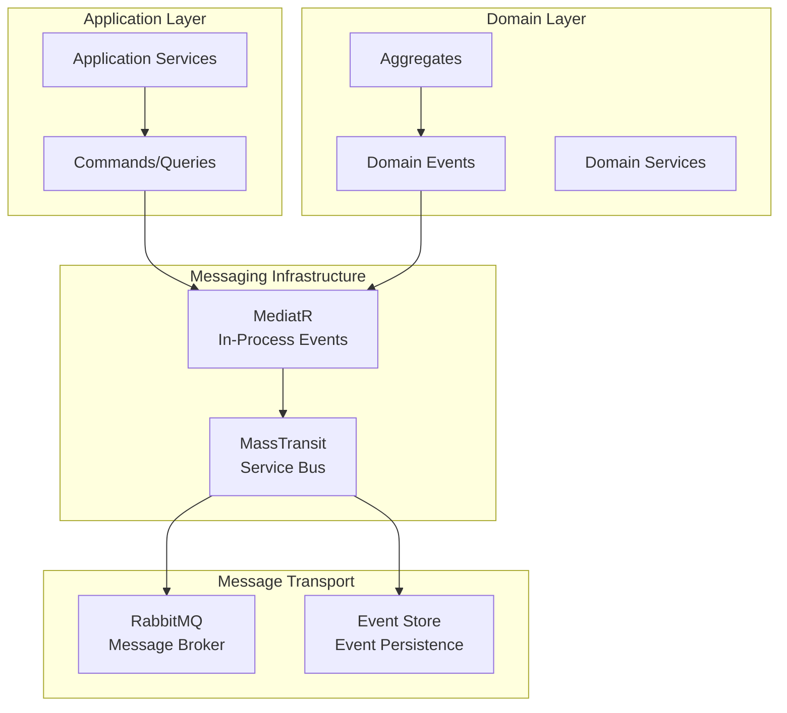
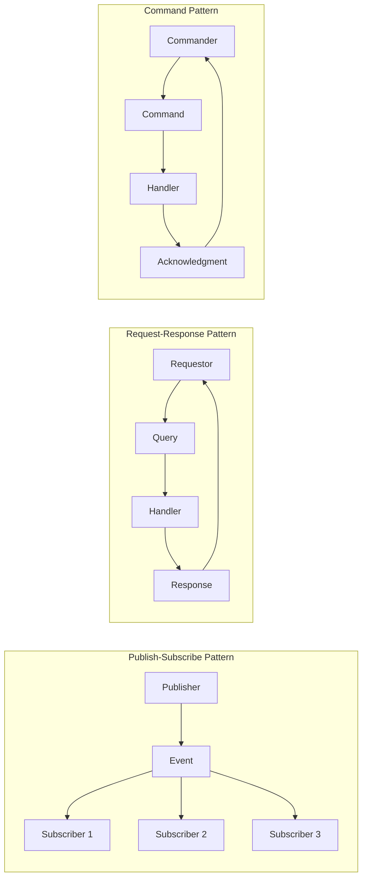
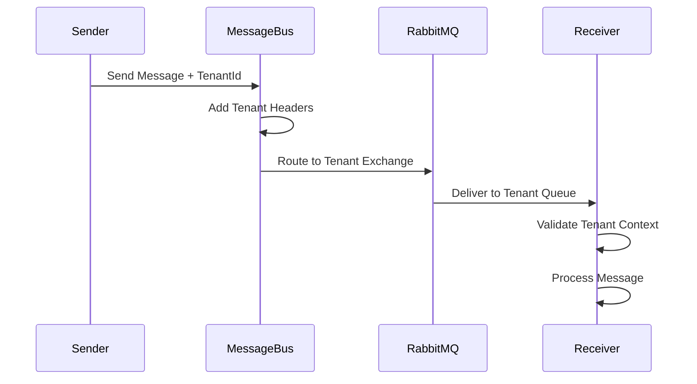
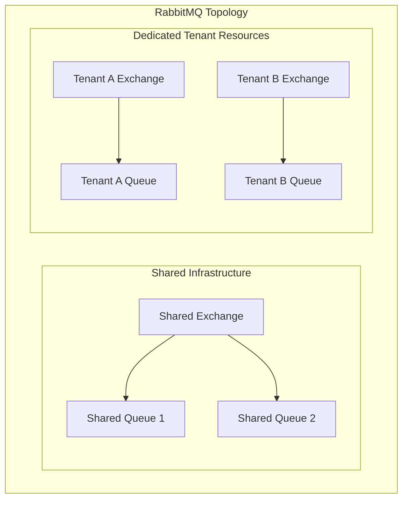
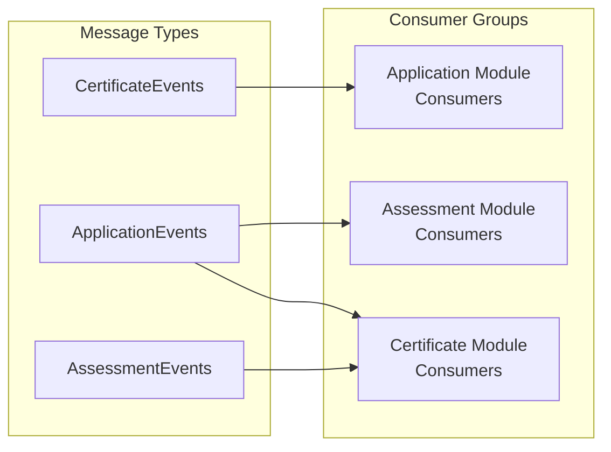
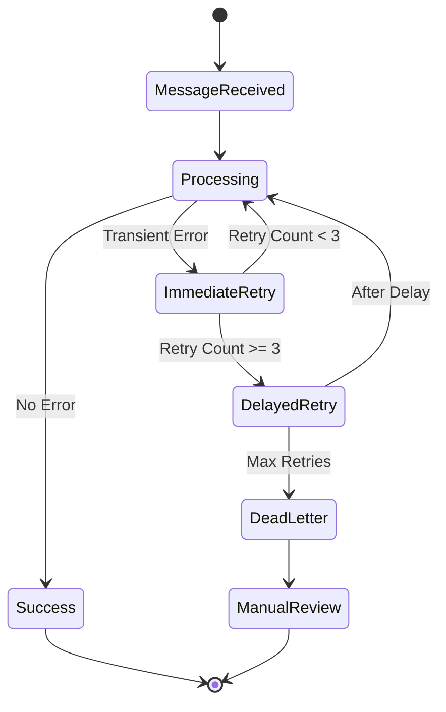
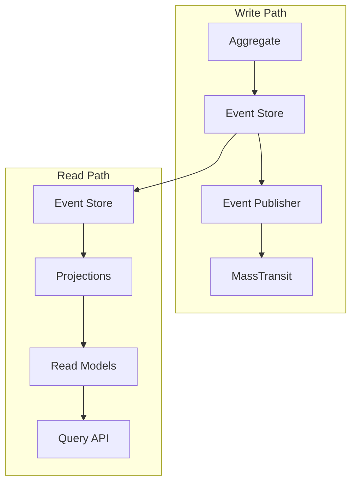
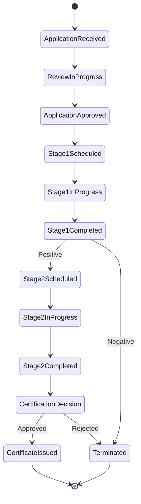
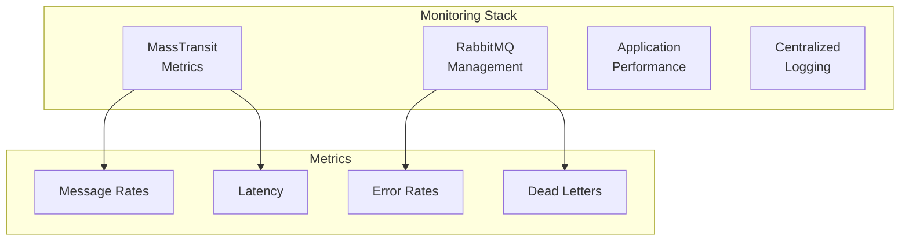
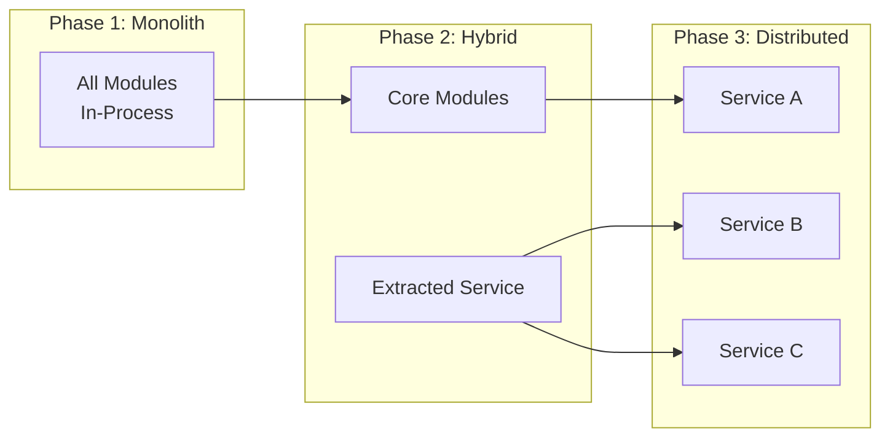

# UCertify Messaging Architecture

## Overview

This document defines the messaging architecture for UCertify, leveraging MassTransit as the service bus abstraction layer with RabbitMQ as the message broker. The architecture supports both in-process communication within the modular monolith and distributed messaging for future microservices extraction.

## Technology Stack

### Core Messaging Components

- **MediatR**: In-process message dispatcher for domain events and CQRS within modules
- **MassTransit**: Service bus abstraction for inter-module and distributed messaging
- **RabbitMQ**: Enterprise message broker for reliable, scalable message delivery
- **Event Store**: Optional event sourcing for audit trail and event replay capabilities

### Architecture Layers

## Message Types and Patterns

### Message Classification

#### 1. Domain Events
Internal state change notifications within the domain model.

**Characteristics**:
- Immutable
- Past tense naming
- Contains all relevant state
- Published after state change
- Tenant-scoped

**Examples**:
- `ApplicationApproved`
- `FindingRecorded`
- `CertificateIssued`

#### 2. Integration Events
Cross-module notifications requiring eventual consistency.

**Characteristics**:
- Module boundary crossing
- Asynchronous processing
- Retry policies
- Versioned contracts
- Tenant isolation enforced

**Examples**:
- `ClientRegistrationCompleted`
- `AssessmentReadyForScheduling`
- `ComplianceViolationDetected`

#### 3. Commands
Directed operations requesting specific actions.

**Characteristics**:
- Imperative mood
- Single handler
- Can fail/be rejected
- Synchronous or asynchronous
- Returns result/acknowledgment

**Examples**:
- `ScheduleAssessment`
- `AssignAuditorToTeam`
- `GenerateComplianceReport`

#### 4. Queries
Read operations requesting data without side effects.

**Characteristics**:
- Request-response pattern
- No state changes
- Can be cached
- Cross-module data aggregation

**Examples**:
- `GetAvailableAuditors`
- `GetClientCertificationHistory`
- `GetComplianceMetrics`

### Message Flow Patterns

## Tenant-Aware Messaging

### Tenant Context Propagation

All messages include tenant context to ensure proper isolation:

### Tenant Routing Strategy

#### Small-Medium Tenants
- Shared exchanges with tenant filtering
- Message headers contain tenant identifier
- Consumer-side filtering

#### Large Enterprise Tenants
- Dedicated exchanges and queues
- Physical isolation at broker level
- Priority message processing

### Multi-Tenant Exchange Topology

## MassTransit Configuration

### Service Bus Topology

#### Exchange Configuration
- **Fanout Exchanges**: For broadcast events
- **Topic Exchanges**: For filtered routing
- **Direct Exchanges**: For command routing
- **Headers Exchanges**: For complex routing rules

#### Queue Configuration
- **Durable Queues**: For persistent messages
- **Priority Queues**: For critical operations
- **TTL Settings**: For message expiration
- **Dead Letter Exchanges**: For failed messages

### Consumer Configuration

### Retry and Error Handling

#### Retry Policies

1. **Immediate Retry**: 3 attempts with exponential backoff
2. **Delayed Retry**: After 5 minutes, 30 minutes, 2 hours
3. **Dead Letter Queue**: After all retries exhausted
4. **Manual Intervention**: For critical business processes

#### Error Handling Strategy

## Event Sourcing Integration

### Event Store Architecture

### Event Stream Design

#### Stream Naming Convention
- `{TenantId}-{AggregateType}-{AggregateId}`
- Example: `CAB123-Application-APP-2025-00001`

#### Event Metadata
- Event ID (UUID)
- Tenant ID
- Aggregate ID
- Event Type
- Timestamp
- User ID
- Correlation ID
- Causation ID

## Saga Management

### Saga Implementation Pattern

### Saga State Management
- Persistent state storage
- Compensation logic for failures
- Timeout handling
- Idempotent message handling

## Performance Optimization

### Message Batching
- Batch size limits (100 messages)
- Time-based flushing (100ms)
- Priority message bypass

### Parallelism Configuration
- Consumer concurrency limits
- Partition strategies for scalability
- Message ordering guarantees where required

### Caching Strategies
- Query result caching
- Projection caching
- Cache invalidation via events

## Monitoring and Observability

### Message Flow Monitoring

### Key Metrics
- Message throughput per tenant
- Processing latency by message type
- Error rates and retry counts
- Queue depths and consumer lag
- Dead letter queue monitoring

### Distributed Tracing
- Correlation ID propagation
- Trace context headers
- End-to-end request tracking
- Performance bottleneck identification

## Security Considerations

### Message Security
- Message encryption in transit (TLS)
- Message signing for integrity
- Tenant isolation validation
- Access control per queue/exchange

### Audit Trail
- All messages logged with context
- Sensitive data masking
- Retention policies per message type
- Compliance with data regulations

## Migration and Evolution

### Versioning Strategy

#### Message Versioning
- Semantic versioning for contracts
- Backward compatibility requirements
- Version negotiation support
- Deprecation timeline (3 months minimum)

#### Evolution Patterns
1. **Adding Fields**: Always optional with defaults
2. **Removing Fields**: Mark deprecated first
3. **Changing Types**: New version required
4. **Renaming**: Map in consumer, deprecate old

### Module Extraction Process

## Disaster Recovery

### Message Persistence
- All messages persisted to disk
- Replication across multiple nodes
- Regular backup of message stores
- Point-in-time recovery capability

### Failover Strategy
- Active-passive broker configuration
- Automatic failover with health checks
- Message replay from event store
- Zero message loss guarantee

---

*Document Version: 1.0*  
*Last Updated: 2025-01-06*  
*Review Frequency: Quarterly*

**Related Documents**:
- [Architecture Vision](./architecture-vision.md)
- [Modular Architecture](./modular-architecture.md)
- [Domain Model](./domain-model.md)
- [API Design Guidelines](./api-design-guidelines.md)