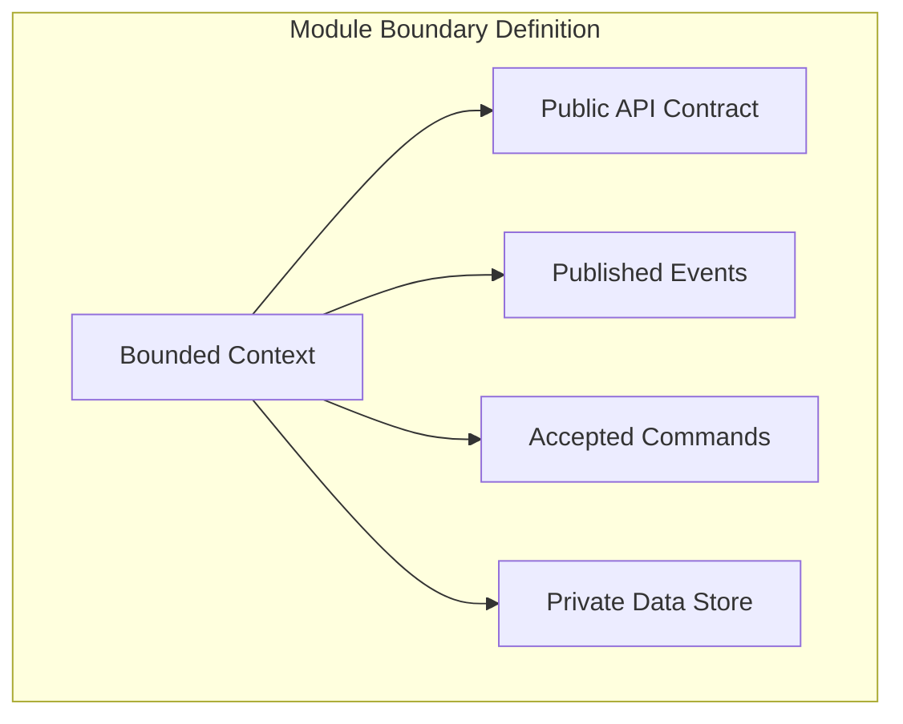
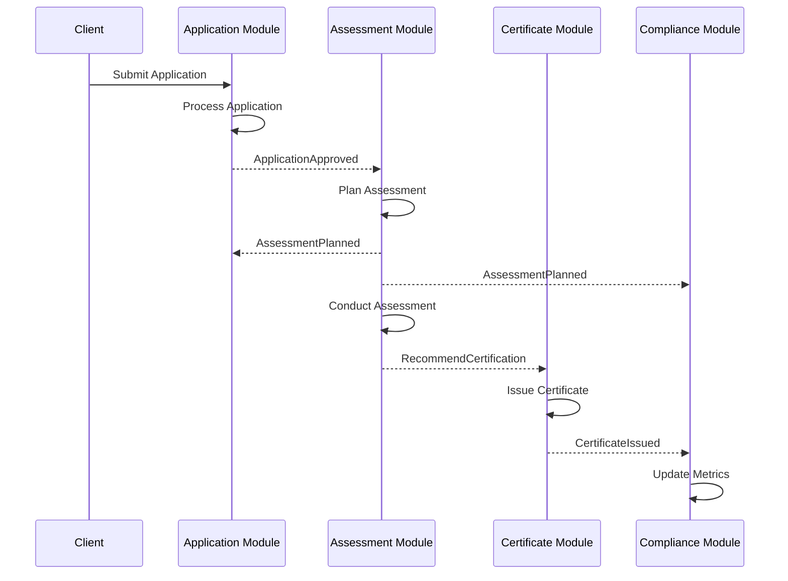
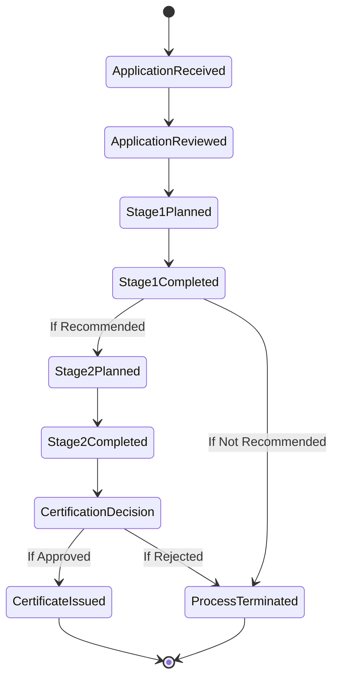
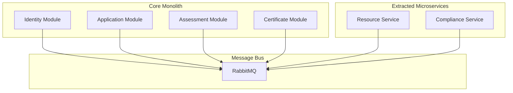

# UCertify Modular Architecture

## Overview

This document details the modular architecture design for the UCertify platform. The system is structured as a service bus-enabled modular monolith, where each module represents a bounded context with well-defined responsibilities, interfaces, and data ownership.

## Architecture Principles

### Module Design Principles

1. **High Cohesion**: Each module encapsulates related functionality within a single business capability
2. **Loose Coupling**: Modules communicate exclusively through service bus messages
3. **Data Ownership**: Each module owns its data and exposes it only through published interfaces
4. **Autonomous Teams**: Modules can be developed and deployed independently
5. **Technology Agnostic**: Module interfaces allow for different internal implementations

### Module Boundaries



## Module Catalog

### 1. Identity & Tenant Management Module

#### Purpose
Manages the platform-level concerns of tenant lifecycle, user authentication, and cross-cutting security policies.

#### Responsibilities
- CAB (tenant) registration and configuration
- User authentication and authorization
- Tenant isolation policy enforcement
- Platform-level user management
- Security token management

#### Module Interfaces

**Commands Accepted**:
- `RegisterNewCAB`
- `UpdateCABConfiguration`
- `CreateUser`
- `AssignUserRole`
- `SuspendCAB`

**Events Published**:
- `CABRegistered`
- `CABConfigurationUpdated`
- `UserCreated`
- `UserRoleChanged`
- `CABSuspended`

**Query Interfaces**:
- `GetTenantContext`
- `ValidateUserAccess`
- `GetCABConfiguration`

#### Data Ownership
- Conformity Assessment Bodies (CABs)
- Users and Roles
- Tenant Configurations
- Security Policies

### 2. Application Management Module

#### Purpose
Handles the certification application lifecycle from initial client inquiry through application approval.

#### Responsibilities
- Application intake and validation
- Client organization management
- Document collection and verification
- Application review workflow
- Contract generation triggers

#### Module Interfaces

**Commands Accepted**:
- `SubmitApplication`
- `ReviewApplication`
- `RequestAdditionalInformation`
- `ApproveApplication`
- `RejectApplication`
- `RegisterClient`

**Events Published**:
- `ApplicationReceived`
- `ApplicationUnderReview`
- `InformationRequested`
- `ApplicationApproved`
- `ApplicationRejected`
- `ClientRegistered`

**Query Interfaces**:
- `GetApplicationDetails`
- `GetClientApplications`
- `GetPendingReviews`
- `GetApplicationDocuments`

#### Data Ownership
- Applications
- Clients (Organizations)
- Application Documents
- Review History

### 3. Assessment & Audit Module

#### Purpose
Manages the complete audit lifecycle including planning, execution, findings management, and corrective action tracking.

#### Responsibilities
- Audit planning and scheduling
- Audit team assignment
- Finding recording and classification
- Evidence management
- Corrective action tracking
- Audit report generation

#### Module Interfaces

**Commands Accepted**:
- `PlanAssessment`
- `AssignAuditTeam`
- `RecordFinding`
- `ClassifyFinding`
- `SubmitCorrectiveAction`
- `VerifyCorrectiveAction`
- `CompleteAssessment`

**Events Published**:
- `AssessmentPlanned`
- `AuditTeamAssigned`
- `FindingRecorded`
- `CorrectiveActionSubmitted`
- `CorrectiveActionVerified`
- `AssessmentCompleted`
- `RecommendationMade`

**Query Interfaces**:
- `GetAssessmentPlan`
- `GetAssessmentFindings`
- `GetCorrectiveActionStatus`
- `GetAuditProgress`

#### Data Ownership
- Assessments
- Audit Plans
- Findings
- Corrective Actions
- Audit Evidence
- Assessment Reports

### 4. Certificate Management Module

#### Purpose
Manages certificate issuance, lifecycle, surveillance scheduling, and compliance maintenance.

#### Responsibilities
- Certificate issuance processing
- Certificate status management
- Surveillance audit scheduling
- Certificate suspension/withdrawal
- Public registry maintenance
- Certificate renewal processing

#### Module Interfaces

**Commands Accepted**:
- `IssueCertificate`
- `SuspendCertificate`
- `WithdrawCertificate`
- `ScheduleSurveillance`
- `RenewCertificate`
- `UpdateCertificateScope`

**Events Published**:
- `CertificateIssued`
- `CertificateSuspended`
- `CertificateWithdrawn`
- `SurveillanceScheduled`
- `CertificateRenewed`
- `CertificateScopeUpdated`

**Query Interfaces**:
- `GetCertificateDetails`
- `GetActiveCertificates`
- `GetSurveillanceSchedule`
- `VerifyCertificate` (public)

#### Data Ownership
- Certificates
- Certificate Scopes
- Surveillance Schedules
- Certificate History
- Public Registry Data

### 5. Resource Management Module

#### Purpose
Manages auditor competencies, availability, assignments, and professional development.

#### Responsibilities
- Auditor profile management
- Competence matrix maintenance
- Availability tracking
- Assignment optimization
- Conflict of interest management
- CPD tracking

#### Module Interfaces

**Commands Accepted**:
- `RegisterAuditor`
- `UpdateCompetence`
- `SetAvailability`
- `AssignToAssessment`
- `RecordCPD`
- `DeclareConflictOfInterest`

**Events Published**:
- `AuditorRegistered`
- `CompetenceUpdated`
- `AvailabilityChanged`
- `AuditorAssigned`
- `ConflictDeclared`
- `CPDRecorded`

**Query Interfaces**:
- `FindAvailableAuditors`
- `GetAuditorCompetencies`
- `CheckConflictOfInterest`
- `GetAuditorSchedule`

#### Data Ownership
- Auditors
- Competencies
- Availability Schedules
- Assignments
- Conflict Declarations
- CPD Records

### 6. Compliance & Reporting Module

#### Purpose
Cross-cutting module that aggregates data from other modules to provide compliance monitoring, analytics, and reporting.

#### Responsibilities
- ISO 17021 compliance tracking
- Audit trail aggregation
- Analytics and dashboards
- Accreditation body reporting
- Performance metrics calculation
- Compliance alerts

#### Module Interfaces

**Commands Accepted**:
- `GenerateComplianceReport`
- `ScheduleRecurringReport`
- `UpdateComplianceRule`
- `TriggerComplianceCheck`

**Events Published**:
- `ComplianceViolationDetected`
- `ReportGenerated`
- `MetricThresholdExceeded`
- `ComplianceCheckCompleted`

**Query Interfaces**:
- `GetComplianceStatus`
- `GetPerformanceMetrics`
- `GetAuditTrail`
- `GetDashboardData`

#### Data Ownership
- Aggregated Metrics
- Report Definitions
- Compliance Rules
- Audit Trail (copy)
- Dashboard Projections

## Module Communication Patterns

### Event-Driven Choreography



### Saga Orchestration

For complex multi-step processes, saga orchestration ensures consistency:



## Module Deployment Strategies

### Modular Monolith Deployment

```mermaid
graph TB
    subgraph "Monolith Deployment Unit"
        subgraph "Application Host"
            M1[Identity Module]
            M2[Application Module]
            M3[Assessment Module]
            M4[Certificate Module]
            M5[Resource Module]
            M6[Compliance Module]
            BUS[In-Process Bus]
        end
    end
    
    subgraph "Infrastructure"
        MQ[RabbitMQ]
        DB[(PostgreSQL)]
    end
    
    M1 -.-> BUS
    M2 -.-> BUS
    M3 -.-> BUS
    M4 -.-> BUS
    M5 -.-> BUS
    M6 -.-> BUS
    
    BUS --> MQ
    Application Host --> DB
```

### Future Microservice Extraction



## Module Integration Guidelines

### Contract-First Development
1. Define message contracts before implementation
2. Version all message contracts
3. Support backward compatibility
4. Document breaking changes

### Message Contract Example Structure
```
Messages/
├── Commands/
│   ├── ApplicationManagement/
│   │   ├── SubmitApplication.v1.json
│   │   └── ApproveApplication.v1.json
│   └── AssessmentManagement/
│       ├── PlanAssessment.v1.json
│       └── RecordFinding.v1.json
└── Events/
    ├── ApplicationManagement/
    │   ├── ApplicationApproved.v1.json
    │   └── ApplicationRejected.v1.json
    └── AssessmentManagement/
        ├── AssessmentCompleted.v1.json
        └── FindingRecorded.v1.json
```

### Testing Strategies

1. **Unit Testing**: Test module internals in isolation
2. **Integration Testing**: Test module interactions through message contracts
3. **Contract Testing**: Verify message contract compatibility
4. **End-to-End Testing**: Test complete business scenarios

## Module Evolution Guidelines

### Adding New Modules
1. Define clear bounded context
2. Identify module responsibilities
3. Design message contracts
4. Implement module interfaces
5. Register with service bus
6. Deploy as part of monolith

### Extracting Modules to Microservices
1. Ensure clean message-based interfaces
2. Extract data to separate schema/database
3. Deploy as independent service
4. Route messages through external bus
5. Monitor performance and reliability
6. Implement circuit breakers

### Module Versioning Strategy
- Modules version independently
- Message contracts version separately
- Support multiple versions concurrently
- Deprecation notices minimum 3 months
- Breaking changes require major version

## Performance Considerations

### Message Processing
- Asynchronous processing by default
- Configurable retry policies
- Dead letter queue handling
- Message deduplication
- Ordered processing where required

### Data Access Patterns
- Read models for cross-module queries
- Eventually consistent projections
- Caching strategies per module
- Bulk operations support

## Security Boundaries

### Module-Level Security
1. Each module validates tenant context
2. Message-level authorization
3. Data encryption in transit
4. Audit logging of all operations
5. Rate limiting per tenant

### Cross-Module Security
1. Service bus authentication
2. Message signing and validation
3. Tenant context propagation
4. Security event correlation

---

*Document Version: 1.0*  
*Last Updated: 2025-01-06*  
*Review Frequency: Quarterly*

**Related Documents**:
- [Architecture Vision](./architecture-vision.md)
- [Domain Model](./domain-model.md)
- [Messaging Architecture](./messaging-architecture.md)
- [API Design Guidelines](./api-design-guidelines.md)